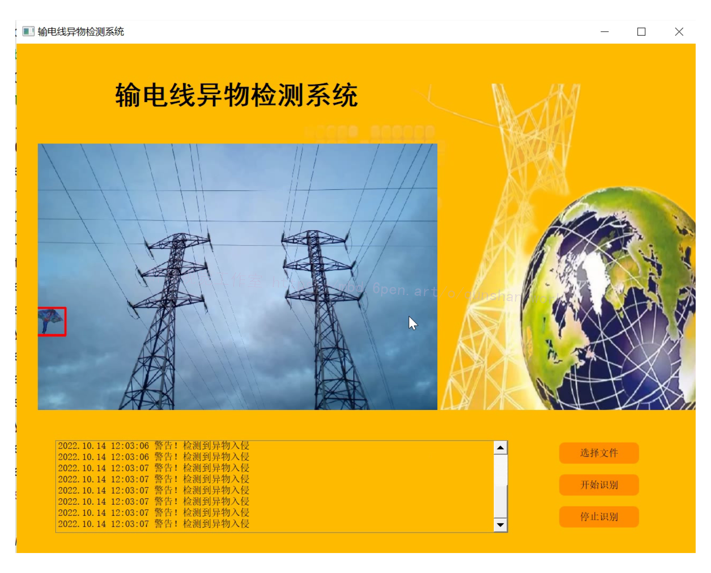
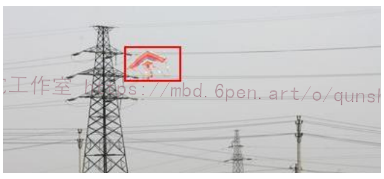

# 1.研究背景
一种高压线异物入侵目标检测方法，本方法包括，从视频监控终端或视频录像中提取相邻帧图像，然后对提取相邻帧图像进行图像的预处理，提取相邻两帧图像运动特征，检测异物或入侵目标，采用形态学方法，对异物入侵目标进行标记，对异物或入侵目标进行跟踪，判断是否影响输电线路，如影响，报警。该方法能够实现对异物入侵目标的快速、准确检测，实时对高压线进行监控，能满足实际应用需要。

# 2.图片演示



# 3.视频演示
[OpenCV的高压线异物入侵检测系统（源码＆教程）_哔哩哔哩_bilibili](https://www.bilibili.com/video/BV1jW4y1J7s2/?vd_source=bc9aec86d164b67a7004b996143742dc)


# 4.算法流程图


# 5.混合高斯模型背景提取 

[该博客采用混合高斯模型（MOG）](https://mbd.pub/o/bread/mbd-Y5qUmZtq)作为背景的统计模型，对每个高斯分布的参数不断进行更新以适应背景的逐渐变化;该方法对于非完全静止的时变背景有较好的适应能力;但MOG的缺点在于，当图像边缘纹理、颜色变化很明显的情况下，识别前景对象仍不是很准确 l;
本研究采用改进的混合高斯模型，在一定边框范围内，利用像素局部邻域之间的相关性，采用每一个像素点及其邻域组成的集合作为特征矢量来描述图像。为了更加充分地利用边缘空间背景，本研究扩大图像背景分割建模，以从重复变化的背景中提取出活动目标。
#### 图像的混合高斯分布表示
利用像素邻域之间的相关性，采用每一个像素点及其邻域组成的集合作为特征矢量来描述图像。例如，对像素x55 采用其5×5邻域像素构成特征向量，即x55(x11,… x15,x21,…，x25, x31,… x35, x41,… x45 x51,… x55)T。
为使白天、黑夜获得同样的识别效果，本系统使用灰度图像序列。



# 6.基于像素亮度的特征
为了解决像素的亮度随着光照的变化而改变，引入Markov模型。像素亮度特征是背景建模中常用的一个特征。在一个完全静止的场景中，一个像素在一段时间内的亮度变化服从高斯分布N( u , o )。如果场景变化缓慢，那么只要用基本的高斯模型就可以适应这种变化。在模型需要更新时，可以使用各种滤波器来实现。
在现实中，完全静止的场景是不存在的。严格地说，在每一种情况下，像素都会呈现出不同的亮度值，具有不同的分布。因此，只用单个的高斯分布来模拟像素亮度的概率密度函数是不充分的。使用混合高斯分布(MOG）是建模时一种比较好的方法。
把每个像素在一段时间内的值作为一个“像素过程”，场景中每个像素最近观察值的分布用一个混合高斯分布来表示。每个新的像素值可以由混合模型的主要组成之一来表示。这种方法通过缓慢改变高斯分布值来处理光照的渐变问题，同时还可以处理阴影、摄像头抖动问题，可有效地实现图像监控系统活动对象识别功能。再加上利用像素亮度的亮度特征，通过非参数核密度估计对背景建模。其模型保留图像中每个像素亮度值的样本，然后用这个样本来估计像素亮度分布的密度函数。这个模型可以估计任何新观察像素值的概率，达到处理背景比较凌乱、背景与前景同色的问题，同时减少由于摄像头的抖动而引起的误识。
#### 基于块的特征
背景建模的过程也用到基于块特征的方法。
在背景学习的过程中用每一个块的中值模板和块标准偏移来代替第一块。在每一个新帧，每一块与它的模板对应。如果某块相对于标准偏移量的偏移程度很大，就认为它是前景区域。
#### 背景建模的保持
背景建模的保持是背景算法的一个难点。[该博客](https://afdian.net/item?plan_id=40585f80598511eda53a52540025c377)综合考虑以下的一些问题:
①背景对象可以移动，这种情况可能会被检测为前景;自然光照的渐亮变化;
③光照的突变，例如闪电等天气的突然变化;
④摆动的树枝和草叶，这种情况使背景像素值频繁改变，且像素值之间的关系不是很清晰;
⑤云彩或塔身投入的阴影;⑥活动对象停在场景中;
背景模型的保持拟从多种空间尺度来处理，例如结合图像像素、区域、帧的特征，从像素级、区域级、帧级综合进行运算，是自上而下的阶梯式处理方法。
像素级只用到孤立像素点的信息，将前景和背景进行第一次分离。像素级能处理一些问题，例如可动背景、光照的渐变和摆动树枝等。

# 7.代码实现
```
import numpy as np
import cv2
import time
import datetime

colour=((0, 205, 205),(154, 250, 0),(34,34,178),(211, 0, 148),(255, 118, 72),(137, 137, 139))#定义矩形颜色

cap = cv2.VideoCapture("vtest.avi") #参数为0是打开摄像头，文件名是打开视频

fgbg = cv2.createBackgroundSubtractorMOG2()#混合高斯背景建模算法

fourcc = cv2.VideoWriter_fourcc(*'XVID')#设置保存图片格式
out = cv2.VideoWriter(datetime.datetime.now().strftime("%A_%d_%B_%Y_%I_%M_%S%p")+'.avi',fourcc, 10.0, (768,576))#分辨率要和原视频对应


while True:
    ret, frame = cap.read()  #读取图片
    fgmask = fgbg.apply(frame)

    element = cv2.getStructuringElement(cv2.MORPH_CROSS, (3, 3))  # 形态学去噪
    fgmask = cv2.morphologyEx(fgmask, cv2.MORPH_OPEN, element)  # 开运算去噪

    _ ,contours, hierarchy = cv2.findContours(fgmask.copy(), cv2.RETR_EXTERNAL, cv2.CHAIN_APPROX_SIMPLE) #寻找前景

    count=0
    for cont in contours:
        Area = cv2.contourArea(cont)  # 计算轮廓面积
        if Area < 300:  # 过滤面积小于10的形状
            continue

        count += 1  # 计数加一

        print("{}-prospect:{}".format(count,Area),end="  ") #打印出每个前景的面积

        rect = cv2.boundingRect(cont) #提取矩形坐标

        print("x:{} y:{}".format(rect[0],rect[1]))#打印坐标

        cv2.rectangle(frame,(rect[0],rect[1]),(rect[0]+rect[2],rect[1]+rect[3]),colour[count%6],1)#原图上绘制矩形
        cv2.rectangle(fgmask,(rect[0],rect[1]),(rect[0]+rect[2],rect[1]+rect[3]),(0xff, 0xff, 0xff), 1)  #黑白前景上绘制矩形

        y = 10 if rect[1] < 10 else rect[1]  # 防止编号到图片之外
        cv2.putText(frame, str(count), (rect[0], y), cv2.FONT_HERSHEY_COMPLEX, 0.4, (0, 255, 0), 1)  # 在前景上写上编号


    cv2.putText(frame, "count:", (5, 20), cv2.FONT_HERSHEY_COMPLEX, 0.6, (0, 255, 0), 1) #显示总数
    cv2.putText(frame, str(count), (75, 20), cv2.FONT_HERSHEY_COMPLEX, 0.6, (0, 255, 0), 1)
    print("----------------------------")

    cv2.imshow('frame', frame)#在原图上标注
    cv2.imshow('frame2', fgmask)  # 以黑白的形式显示前景和背景
    out.write(frame)
    k = cv2.waitKey(30)&0xff  #按esc退出
    if k == 27:
        break


out.release()#释放文件
cap.release()
cv2.destoryAllWindows()#关闭所有窗口
```

# 8.系统整合
[下图源码＆环境部署视频教程＆自定义UI界面](https://s.xiaocichang.com/s/8e3195)


参考[博客《OpenCV的高压线异物入侵检测系统》](https://mbd.pub/o/qunma/work)

# 9.参考文献
***
[1]董凌凌,王玉德,张喆,等.一种改进W4算法的运动目标检测研究[J].激光杂志.2014,(12).DOI:10.14016/j.cnki.jgzz.2014.12.060.
[2]王国胜,张声圳.输电线路防外力破坏监测系统的研究[J].陕西电力.2013,(8).DOI:10.3969/j.issn.1673-7598.2013.08.014.
[3]周经纬.输电线路设备防止外力破坏的对策探讨[J].科技创新与应用.2013,(26).
[4]任克强,余启明,罗会兰.一种改进的混合高斯模型运动目标检测算法[J].电视技术.2012,(23).DOI:10.3969/j.issn.1002-8692.2012.23.047.
[5]刘丽榕,王玉东,肖智宏,等.输电线路在线监测系统通信传输方式研究[J].电力系统通信.2011,(4).DOI:10.3969/j.issn.1005-7641.2011.04.005.
[6]谢蓉,贾金源.图像前景提取技术研究[J].硅谷.2010,(2).DOI:10.3969/j.issn.1671-7597.2010.02.037.
[7]张浩,王玮,徐丽杰,等.图像识别技术在电力设备监测中的应用[J].电力系统保护与控制.2010,(6).DOI:10.3969/j.issn.1674-3415.2010.06.021.
[8]王亮芬.基于SIFT特征匹配和动态更新背景模型的运动目标检测算法[J].计算机应用与软件.2010,(2).DOI:10.3969/j.issn.1000-386X.2010.02.086.
[9]谢兵,许金彤.基于3G网络的输电线路防外力破坏智能视频监控系统研究[J].华东电力.2010,(11).
[10]康会西,李宏斌,张清扬,等.输电线路综合在线监测系统设计[J].电网与清洁能源.2010,(5).DOI:10.3969/j.issn.1674-3814.2010.05.007.

---
#### 如果您需要更详细的【源码和环境部署教程】，除了通过【系统整合】小节的链接获取之外，还可以通过邮箱以下途径获取:
#### 1.请先在GitHub上为该项目点赞（Star），编辑一封邮件，附上点赞的截图、项目的中文描述概述（About）以及您的用途需求，发送到我们的邮箱
#### sharecode@yeah.net
#### 2.我们收到邮件后会定期根据邮件的接收顺序将【完整源码和环境部署教程】发送到您的邮箱。
#### 【免责声明】本文来源于用户投稿，如果侵犯任何第三方的合法权益，可通过邮箱联系删除。